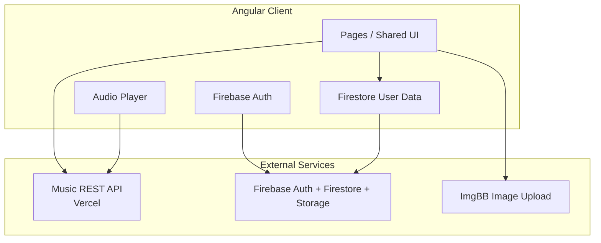
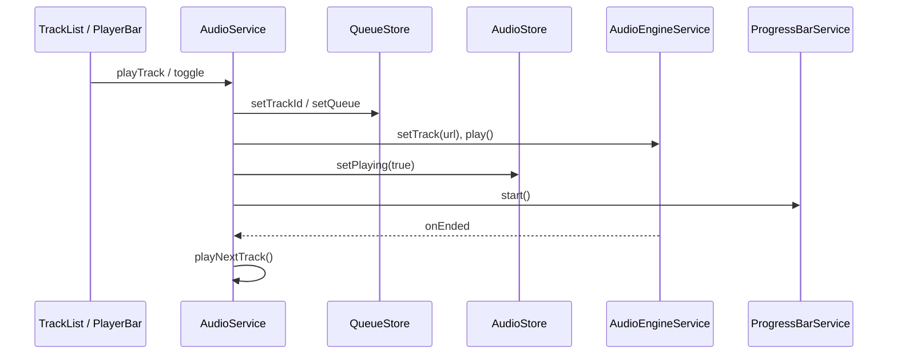

# Krup Music — Technical Documentation

> **Версия документа:** 1.0  
> **Стек:** Angular 21 · TypeScript 5.9 · Firebase · SSR · PWA  
> **Репозиторий:** `music-app/` (корень Angular-приложения)

Документ описывает реальную реализацию проекта на основе исходного кода: архитектуру, фичи, библиотеки, потоки данных, риски и рекомендации.

---

## Содержание

1. [Обзор проекта](#1-обзор-проекта)
2. [Технологический стек](#2-технологический-стек)
3. [Структура репозитория](#3-структура-репозитория)
4. [Bootstrap и инициализация](#4-bootstrap-и-инициализация)
5. [Архитектура приложения](#5-архитектура-приложения)
6. [Маршрутизация и навигация](#6-маршрутизация-и-навигация)
7. [Аутентификация и авторизация](#7-аутентификация-и-авторизация)
8. [Слой данных (API и Firebase)](#8-слой-данных-api-и-firebase)
9. [Управление состоянием](#9-управление-состоянием)
10. [Аудио-плеер](#10-аудио-плеер)
11. [Компонентная архитектура](#11-компонентная-архитектура)
12. [Формы](#12-формы)
13. [Интернационализация (i18n)](#13-интернационализация-i18n)
14. [UI, стили и дизайн-токены](#14-ui-стили-и-дизайн-токены)
15. [RxJS и реактивные потоки](#15-rxjs-и-реактивные-потоки)
16. [SSR, PWA и деплой](#16-ssr-pwa-и-деплой)
17. [Тестирование](#17-тестирование)
18. [Конфигурация и инструменты сборки](#18-конфигурация-и-инструменты-сборки)
19. [Безопасность](#19-безопасность)
20. [Производительность](#20-производительность)
21. [Качество кода и технический долг](#21-качество-кода-и-технический-долг)
22. [Рекомендации и roadmap](#22-рекомендации-и-roadmap)
23. [Итоговая оценка](#23-итоговая-оценка)

---

## 1. Обзор проекта

### 1.1 Назначение

**Krup Music** (`APP_CONFIG.APP_NAME`) — клиентское веб-приложение для прослушивания музыки с функциями стримингового сервиса:

- поиск треков и артистов;
- просмотр профиля артиста, альбома, списка популярных треков;
- воспроизведение аудио с очередью и UI плеера (мини-бар + полноэкранный режим);
- избранные треки (привязка к пользователю Firebase);
- пользовательские плейлисты в Firestore;
- локализация EN/RU;
- установка как PWA.

### 1.2 Тип приложения

| Характеристика | Значение |
|----------------|----------|
| Архитектура клиента | SPA с **SSR** (Server-Side Rendering) |
| Offline / install | **PWA** (Angular Service Worker) |
| Change detection | **Zoneless** (`provideZonelessChangeDetection`) |
| Компоненты | **100% Standalone** (без `NgModule`) |
| Целевая аудитория | B2C — конечные слушатели музыки в браузере |

### 1.3 Бизнес-домены



| Домен | Источник данных | Файлы |
|-------|-----------------|-------|
| Каталог музыки | REST API | `music-api-service.ts`, `music-data.service.ts`, `utils/mappers/*` |
| Пользователь | Firebase Auth | `auth-service.ts` |
| Избранное | Firestore subcollection | `db-service.ts`, `favorite-service.ts` |
| Плейлисты | Firestore collection | `playlists.service.ts` |
| Медиа-обложки плейлистов | ImgBB API | `file-upload.service.ts` |

### 1.4 Пользовательские сценарии

| # | Сценарий | Маршрут / компонент |
|---|----------|---------------------|
| 1 | Вход через Google | `/login` → `LoginPage` |
| 2 | Поиск песен/артистов | `/` → `SearchPage` + `Search` |
| 3 | Просмотр артиста | `/artist/:artistId` → `ArtistPage` |
| 4 | Все треки артиста (infinite scroll) | `/artist/:artistId/tracks` → `ArtistTracksComponent` |
| 5 | Альбом | `/albums/:albumId` → `AlbumPage` |
| 6 | Главная (избранное + плейлисты) | `/main` → `MainPage` |
| 7 | Коллекция (все лайки) | `/collection` → `CollectionPage` |
| 8 | Редактирование плейлиста | `/playlist/:playlistId` → `PlaylistPageComponent` |
| 9 | Воспроизведение / очередь | `AudioService` + `PlayerBarComponent` |
| 10 | Смена языка | `SidebarComponent` → `LanguageService` |

### 1.5 Уровень сложности

**Средний:** ~100+ TypeScript-файлов в `src/app`, несколько интеграций (REST + Firebase + HTML5 Audio + PWA), без enterprise-модулей (RBAC, audit, multi-tenant).

---

## 2. Технологический стек

### 2.1 Основные зависимости (`package.json`)

| Пакет | Версия | Назначение в проекте |
|-------|--------|----------------------|
| `@angular/core` и пакеты `@angular/*` | ^21.2.4 | Фреймворк, router, forms, animations, SSR, SW |
| `@angular/fire` | ^19.0.0 | Firebase Auth, Firestore, Storage |
| `firebase` | ^11.0.0 | SDK Firebase (используется совместно с Angular Fire) |
| `@ngrx/signals` | ^21.0.1 | Signal stores: очередь, аудио, UI плеера |
| `rxjs` | ~7.8.0 | Потоки: auth, search, audio events, Firestore |
| `@ngx-translate/core` | ^17.0.0 | i18n |
| `@ngx-translate/http-loader` | ^8.0.0 | Загрузка JSON переводов из `public/i18n/` |
| `lucide-angular` | ^0.562.0 | Иконки (tree-shaken через `LucideAngularModule.pick`) |
| `ngx-scrollbar` | ^15.1.2 | Кастомный скролл в `MainLayoutComponent` |
| `fast-average-color` | ^9.5.0 | Доминантный цвет обложки для UI плеера |
| `express` | ^5.1.0 | SSR-сервер (`src/server.ts`) |
| `zone.js` | ~0.15.0 | Только для unit-тестов (polyfills в Karma) |
| `tslib` | ^2.3.0 | Runtime helpers для TS |

### 2.2 Dev-зависимости

| Пакет | Назначение |
|-------|------------|
| `@angular/cli`, `@angular/build` | Сборка, dev-server, application builder |
| `@angular/compiler-cli` | AOT compilation |
| `typescript` ~5.9.3 | Strict mode |
| `karma`, `jasmine-core`, `karma-*` | Unit-тесты |
| `@types/node`, `@types/express`, `@types/jasmine` | Типы |

### 2.3 Что сознательно не используется

- **NgModules** — проект полностью на standalone components
- **NgRx Store / Effects** — только `@ngrx/signals` для локальных store
- **Angular Material / PrimeNG / Tailwind** — кастомный CSS
- **HTTP Interceptors** — отсутствуют
- **ESLint** — не настроен в репозитории
- **E2E** (Playwright/Cypress) — не настроен
- **Nx monorepo** — один проект в `angular.json`

### 2.4 Angular-возможности, активно используемые в коде

| API | Где |
|-----|-----|
| Standalone components | Все компоненты |
| `inject()` | Сервисы, guards, stores |
| Signals (`signal`, `computed`, `effect`) | Stores, pages, UI |
| `input()` / `output()` | Route params, dumb components |
| `rxResource` | Artist, album, playlist, favorites, colors |
| `toSignal` | `AuthService.user` |
| `takeUntilDestroyed` | Audio, search |
| `provideZonelessChangeDetection` | `app.config.ts` |
| `withComponentInputBinding` | Route → component inputs |
| `loadComponent` lazy routes | `app.routes.ts` |
| `provideClientHydration(withEventReplay)` | SSR hydration |
| `NgOptimizedImage` | `EntityHeaderComponent` |
| Control flow `@for`, `@if` | Templates |
| `ControlValueAccessor` | `PlaylistCoverComponent` |

---

## 3. Структура репозитория

```
music-app/
├── ARCHITECTURE.md          # этот документ
├── README.md                # CLI-инструкции (частично устарели: Vitest vs Karma)
├── angular.json             # build, serve, test, SSR, budgets
├── package.json
├── package-lock.json
├── ngsw-config.json         # PWA asset groups
├── tsconfig.json            # strict + project references
├── tsconfig.app.json
├── tsconfig.spec.json
├── .npmrc
├── .vscode/settings.json
├── public/
│   ├── i18n/en.json, ru.json
│   ├── manifest.webmanifest
│   └── icons/               # PWA icons
└── src/
    ├── index.html
    ├── main.ts              # browser bootstrap
    ├── main.server.ts       # server bootstrap
    ├── server.ts            # Express SSR handler
    ├── styles.css           # global CSS variables
    ├── environments/
    │   └── environment.ts   # firebaseConfig
    └── app/
        ├── app.ts           # root component
        ├── app.config.ts
        ├── app.config.server.ts
        ├── app.routes.ts
        ├── app.routes.server.ts
        ├── icons.config.ts
        ├── guards/
        ├── models/
        ├── pages/           # feature routes
        ├── shared/
        │   ├── ui/
        │   └── derectives/  # typo: directives
        └── core/
            ├── layout/
            ├── services/
            │   ├── audio-logic/
            │   └── data-services/
            ├── store/
            ├── pipes/
            └── utils/
```

### 3.1 Слои и ответственность

| Слой | Путь | Ответственность |
|------|------|-----------------|
| **Pages** | `src/app/pages/` | Route-level smart components, оркестрация данных страницы |
| **Shared UI** | `src/app/shared/ui/` | Переиспользуемые presentation/smart UI blocks |
| **Core layout** | `src/app/core/layout/` | App shell: sidebar, player bar, fullscreen player |
| **Core services** | `src/app/core/services/` | Domain + infrastructure services |
| **Core store** | `src/app/core/store/` | Глобальное состояние плеера (`@ngrx/signals`) |
| **Models** | `src/app/models/` | Domain types + API DTO interfaces |
| **Guards** | `src/app/guards/` | Functional route guards |
| **Utils** | `src/app/core/utils/` | Constants, mappers, helpers |

---

## 4. Bootstrap и инициализация

### 4.1 Browser entry

```typescript
// src/main.ts
bootstrapApplication(App, appConfig)
```

### 4.2 `ApplicationConfig` (`app.config.ts`)

Порядок регистрации провайдеров:

| Provider | Назначение |
|----------|------------|
| `provideZonelessChangeDetection()` | CD без Zone.js в runtime |
| `provideRouter(routes, withComponentInputBinding(), withPreloading(PreloadAllModules))` | Routing + preload |
| `provideClientHydration(withEventReplay())` | SSR hydration (**дублируется дважды в файле**) |
| `provideHttpClient(withFetch())` | HTTP через Fetch API |
| `provideFirebaseApp`, `provideAuth`, `provideFirestore`, `provideStorage` | Firebase |
| `provideTranslateService` + `TranslateHttpLoader` | i18n из `./i18n/*.json` |
| `importProvidersFrom(LucideAngularModule.pick(icons))` | Иконки |
| `provideServiceWorker` | PWA (**дублируется дважды**) |

### 4.3 Root component (`app.ts`)

- `ChangeDetectionStrategy.OnPush`
- При `ngOnInit`: `LanguageService.init()` — восстановление языка из localStorage
- Инжект `MediaSessionService` — регистрация Media Session API handlers (side effect в constructor)

### 4.4 Server entry

- `main.server.ts` + `app.config.server.ts` — merge с `provideServerRendering(withRoutes(serverRoutes))`
- `server.ts` — Express: static из `dist/.../browser`, остальное через `AngularNodeAppEngine`

---

## 5. Архитектура приложения

### 5.1 Архитектурный стиль

**Feature-based + layered architecture** с элементами **smart/container** и **presentation** компонентов.

```
┌─────────────────────────────────────────────────────────┐
│  App (root)                                              │
│    └── RouterOutlet                                      │
│          ├── LoginPage (lazy, public)                    │
│          └── MainLayoutComponent (auth shell)            │
│                ├── SidebarComponent                      │
│                ├── NgScrollbar → RouterOutlet (pages)    │
│                ├── PlayerBarComponent                    │
│                └── FullScreenPlayerComponent             │
└─────────────────────────────────────────────────────────┘
```

### 5.2 Dependency Injection

- Все сервисы и stores: **`providedIn: 'root'`**
- Нет feature-level `providers` в routes
- Нет abstract tokens / interfaces для подмены в тестах (кроме ручного mock в spec)

### 5.3 Паттерны

| Паттерн | Реализация |
|---------|------------|
| Smart / Dumb | Частично: `TrackRowComponent` — dumb; `TrackList` — smart (player + favorites) |
| Mapper | `track.mapper.ts`, `artist.mapper.ts`, `album.mapper.ts` |
| Signal Store | `QueueStore`, `AudioStore`, `PlayerUiStore` |
| Resource | `rxResource` для async page data |
| Facade | **Отсутствует** — pages inject services напрямую |

### 5.4 Отсутствующие архитектурные элементы

- NgModules, barrel exports (`index.ts`)
- HTTP interceptors (auth, errors, logging)
- Route resolvers
- Centralized error handling / notification service
- Environment split (`environment.prod.ts`)
- CI/CD pipelines в репозитории

---

## 6. Маршрутизация и навигация

### 6.1 Конфигурация (`app.routes.ts`)

```typescript
// Упрощённая схема
'' → MainLayoutComponent [authGuard]
  ├── ''           → SearchPage (lazy)
  ├── 'collection' → CollectionPage (lazy)
  ├── 'main'       → MainPage (lazy)
  ├── 'artist/:artistId' → ArtistPage (lazy)
  ├── 'artist/:artistId/tracks' → ArtistTracksComponent (lazy)
  ├── 'albums/:albumId' → AlbumPage (lazy)
  └── 'playlist/:playlistId' → PlaylistPageComponent (lazy)

'login' → LoginPage (lazy) [loginGuard]
```

### 6.2 Особенности

- **Lazy loading:** `loadComponent: () => import(...).then(m => m.X)` — component-based lazy load (Angular 17+)
- **Input binding:** `artistId`, `albumId`, `playlistId` приходят как `input()` благодаря `withComponentInputBinding()`
- **Preloading:** `PreloadAllModules` — legacy-имя; с `loadComponent` поведение может отличаться от классических NgModule routes

### 6.3 SSR routes (`app.routes.server.ts`)

Все перечисленные пути и `**` используют `RenderMode.Server` — полный server render, без prerender для статических страниц.

### 6.4 Guards

| Guard | Файл | Логика |
|-------|------|--------|
| `authGuard` | `guards/auth.guard.ts` | На SSR (`isPlatformServer`) → `true`. В браузере: `auth.user$` → redirect `/login` если `null` |
| `loginGuard` | `guards/login.guard.ts` | Если user есть → redirect `/` |

**Замечание:** `loginGuard` не проверяет SSR platform — возможна асимметрия с `authGuard`.

---

## 7. Аутентификация и авторизация

### 7.1 `AuthService` (`core/services/auth-service.ts`)

```typescript
user$ = authState(this.auth);           // Observable для guards
user = toSignal(authState(this.auth)); // Signal для templates
```

| Метод | Поведение |
|-------|-----------|
| `login()` | `signInWithPopup(GoogleAuthProvider)` → navigate `/` |
| `logout()` | `signOut` → navigate `login` |

### 7.2 Хранение сессии

Firebase Auth управляет токенами; приложение **не** кладёт JWT вручную в localStorage.

### 7.3 Защита маршрутов

Только client-side functional guards. Для SSR-страниц auth не блокирует render на сервере (`authGuard` returns `true` on server).

---

## 8. Слой данных (API и Firebase)

### 8.1 Music REST API

**Base URL:** `https://music-app-api-two.vercel.app/api` (`core/utils/constants/api.constants.ts`)

| Метод сервиса | Endpoint | DTO → Domain |
|---------------|----------|--------------|
| `searchSongs` | `GET /search/songs` | `ApiSearchResponse` → `Track[]` |
| `searchArtists` | `GET /search/artists` | `ApiArtistSearchResponse` → `Artist[]` |
| `getArtistById` | `GET /artists/:id` | `ArtistResponse` → `ArtistProfile` |
| `getAlbumById` | `GET /albums?id=` | `ApiAlbumResponse` → `Album` |
| `getTracksByArtistId` | `GET /artists/:id/songs` | `ApiPopularTracksResponse` → `Track[]` |

**Цепочка:**

```
MusicApiService (HttpClient)
    → MusicDataService (map + tap + mappers)
        → Components / Search
```

**Проблемы типизации:** параметры запросов объявлены как `params: any` в `music-api-service.ts`.

### 8.2 Mappers

| Файл | Функция |
|------|---------|
| `utils/mappers/track.mapper.ts` | `transformToTrack` — cover/audio URL через `getBestResolution` |
| `utils/mappers/artist.mapper.ts` | `transformToArtist`, `artistByIdMapper` |
| `utils/mappers/album.mapper.ts` | `albumByIdMapper` |

### 8.3 Domain model (`models/app-interface.ts`)

```typescript
interface Track {
  id, title, artist, artistId, album, duration, audioUrl, coverUrl
}
interface Album { id, name, description, year, coverUrl, artistName, artistId, tracks }
enum PlayingStrategy { ... }  // объявлен, но НЕ используется в коде
```

### 8.4 Firestore

**Константы коллекций** (`firestore.constants.ts`):

| Константа | Путь |
|-----------|------|
| `USERS` | `users` |
| `FAVORITES` | `users/{uid}/favorites` |
| `PLAYLISTS` | `playlists` |

**Сервисы:**

| Сервис | Операции |
|--------|----------|
| `DbService` | `getFavoriteSongs`, `addSongToFavorite`, `removeLike` |
| `PlaylistsService` | CRUD плейлистов, `arrayUnion`/`arrayRemove` для треков |

`runInInjectionContext` используется для `collectionData` / `setDoc` / `deleteDoc` (требование Angular Fire в некоторых контекстах).

**Замечание:** `playlists.service.ts` смешивает импорты `@angular/fire/firestore` и `firebase/firestore`.

### 8.5 Загрузка изображений (ImgBB)

`FileUploadService` — `POST https://api.imgbb.com/1/upload?key=...`

⚠️ API key захардкожен в исходнике — см. [Безопасность](#19-безопасность).

### 8.6 LocalStorage

`LocalStorageService` — JSON serialize, guarded by `isPlatformBrowser`:

| Ключ | Данные |
|------|--------|
| `lastTrack` | Последний трек (QueueStore) |
| `volume` | Громкость (AudioStore) |
| `lang` | Язык UI |

---

## 9. Управление состоянием

### 9.1 Подход

| Тип состояния | Механизм |
|---------------|----------|
| Player queue & current track | `@ngrx/signals` — `QueueStore` |
| Play/pause, volume, mute | `@ngrx/signals` — `AudioStore` |
| Fullscreen, dominant color | `@ngrx/signals` — `PlayerUiStore` |
| Auth user | `toSignal(authState(...))` |
| Page data (artist, album, playlist) | `rxResource` |
| Favorites list | `rxResource` в `FavoriteService` |
| Search results | `signal` на `SearchPage` |
| Local UI (editing, pagination page) | `signal` в компонентах |

**NgRx Store/Effects, Akita, NGXS — не используются.**

### 9.2 `QueueStore` (`core/store/queue.store.ts`)

| State | Описание |
|-------|----------|
| `entities` | `withEntities<Track>()` |
| `currentTrackId` | ID текущего трека |

| Computed | Описание |
|----------|----------|
| `currentIndex` | Индекс в `ids()` |
| `currentTrack` | Entity по id |

| Methods | Описание |
|---------|----------|
| `setQueue(playlist)` | Замена всей очереди |
| `setTrackId(id)` | Текущий трек |
| `getNextTrack` / `getPreviousTrack` | Навигация по очереди |

**Persistence:** `effect` сохраняет `currentTrack` в localStorage; `onInit` восстанавливает последний трек.

### 9.3 `AudioStore` (`core/store/audio.store.ts`)

| Field | Default |
|-------|---------|
| `volume` | 0.5 |
| `isPlaying` | false |
| `isMuted` | false |
| `lastVolumeBeforMute` | 0.5 |

Methods: `setPlaying`, `setVolume`, `toogleMute` (опечатка в имени).

### 9.4 `PlayerUiStore` (`core/store/playerUi.store.ts`)

- `isFullScreen` — toggle полноэкранного плеера
- `mainColor` — `rxResource` по `coverUrl` текущего трека + `ImageColorServiceService`
- SSR-safe: на сервере возвращает default `#323838`

### 9.5 Дублирование и рассинхрон

| Проблема | Детали |
|----------|--------|
| Volume UI ≠ audio element | `AudioStore.setVolume` не вызывает `AudioEngineService.setVolume` |
| Дублирование color extraction | `PlayerUiStore` и `EntityHeaderComponent` оба запрашивают dominant color |
| `FavoriteService.isLiked()` | Синхронный метод, не `computed` — риск stale UI при OnPush |
| `PlayingStrategy` enum | Не подключён к логике repeat/shuffle |

---

## 10. Аудио-плеер

### 10.1 Компоненты цепочки



### 10.2 `AudioEngineService`

- Создаёт `HTMLAudioElement` в `afterNextRender` (SSR-safe)
- `crossOrigin = 'anonymous'` — для canvas/color extraction
- События: `ended`, `timeupdate` → `Subject` + `takeUntilDestroyed`
- API: `setTrack`, `play`, `pause`, `seek`, `setVolume`, getters `currentTime`, `progress`

⚠️ **Известная логическая проблема в `setTrack`:** ранний `return` при `!this.player` может помешать установке `src` до инициализации элемента.

### 10.3 `AudioService`

- Оркестратор: queue + engine + progress + stores
- `effect`: при смене трека → `progressService.reset()`
- Подписка на `engine.onEnded` → `playNextTrack()`
- `playFirstTrack`, `toggle`, `stop`, `playPastTrack`

### 10.4 `ProgressBarService`

- Обновление времени через **`requestAnimationFrame`** (не через `timeupdate` Subject)
- Signals: `currentTime`, `isDragging`, `manualTime`, `displayTime` (computed)
- Seek: `onInput` / `onChange` → `engine.seek`

### 10.5 UI плеера

| Компонент | Файл | Функции |
|-----------|------|---------|
| Mini player | `player-bar-component` | play/pause, seek, volume UI, like, next/prev, open fullscreen |
| Fullscreen | `full-screen-player` | Expanded UI, dynamic CSS var `--dynamic-color` |
| Listen all | `listen-button-component` | `playFirstTrack(playlist)` |

### 10.6 Media Session API

`MediaSessionService` (инжектится в root):

- Handlers: play, pause, nexttrack, previoustrack
- `effect` обновляет `navigator.mediaSession.metadata` при смене трека

---

## 11. Компонентная архитектура

### 11.1 Change Detection

**Почти все компоненты:** `ChangeDetectionStrategy.OnPush`.

**Исключение:** `ListenButtonComponentComponent` — default strategy.

### 11.2 Shared UI каталог

| Компонент | Selector | Назначение |
|-----------|----------|------------|
| `Search` | `app-search` | Debounced search, emits results |
| `TrackList` | `app-track-list` | Список треков + play/like + optional action template |
| `TrackRowComponent` | `app-track-row` | Строка трека |
| `ArtistsList` | `app-artists-list` | Список артистов |
| `EntityHeaderComponent` | `app-entity-header-component` | Hero header сущности |
| `ListenButtonComponent` | `app-listen-button-component` | Play playlist |
| `PlaylistListComponent` | `app-playlist-list` | Список плейлистов пользователя |
| `MediaListSectionComponent` | — | Секции альбомов/артистов на странице артиста |
| `NavigationButtonsComponent` | — | Browser back/forward |
| Skeletons | `*-skeleton` | Loading placeholders |

### 11.3 Directives

| Директива | Файл | Назначение |
|-----------|------|------------|
| `TwitterHoverDirective` | `shared/derectives/twitter-hover.directive.ts` | Показ Twitter-иконки при hover (innerHTML SVG) |

### 11.4 Pipes

| Pipe | Файл |
|------|------|
| `TrackDuringPipe` | `core/pipes/track-during-pipe.ts` — форматирование длительности трека |

### 11.5 Content projection

`TrackList` принимает `actionTemplate: TemplateRef` для кастомных кнопок (добавить/удалить из плейлиста на `PlaylistPage`).

### 11.6 Lists performance

`track-list.html`:

```html
@for(track of tracks(); track track.id) { ... }
```

Virtual scroll **не** используется — длинные списки (`ArtistTracks`) рендерят весь DOM.

---

## 12. Формы

### 12.1 Используемые подходы

| Место | Тип | Детали |
|-------|-----|--------|
| `Search` | `FormControl` | Reactive, debounced search |
| `PlaylistPageComponent` | `FormBuilder.group` | title, coverUrl |
| `PlaylistCoverComponent` | CVA | `ControlValueAccessor` для file/string cover |
| `PlaylistTitleComponent` | signals + inline edit | title editing |
| `LoginPage` | ReactiveFormsModule imported | Фактически только кнопка Google (без form fields) |

### 12.2 Typed forms

Не используются — `UntypedFormGroup` style.

### 12.3 Известные проблемы

```typescript
// playlist-page.component.ts — saveField
control?.disable  // не вызывается disable(), мёртвый код
```

Form инициализируется до загрузки `playlistData`; patch через `effect` — корректный workaround.

---

## 13. Интернационализация (i18n)

### 13.1 Стек

- `@ngx-translate/core` v17
- `@ngx-translate/http-loader` — файлы `public/i18n/en.json`, `ru.json`
- Factory: `TranslateHttpLoader(http, './i18n/', '.json')`

### 13.2 `LanguageService`

| Метод | Поведение |
|-------|-----------|
| `init()` | `addLangs(['en','ru'])`, restore from localStorage или `'en'` |
| `setLanguage(lang)` | `translate.use`, update signal, persist |
| `switchLang()` | toggle en ↔ ru |

### 13.3 Использование в UI

`TranslateModule` в sidebar, search, collection, artist, album, login и др.

Ключи сгруппированы: `SIDEBAR`, `SEARCH`, `COLLECTION`, `ARTIST_PROFILE`, `ALBUM_PAGE`, `LOGIN_PAGE`, `MAIN`.

---

## 14. UI, стили и дизайн-токены

### 14.1 Подход

- **Без UI-фреймворка** — custom CSS per component + global variables
- **Иконки:** Lucide (`icons.config.ts` — tree-shaken subset)
- **Скролл:** `ngx-scrollbar` в main layout
- **Шрифт:** Lato (global `styles.css`)

### 14.2 Design tokens (`src/styles.css`)

```css
:root {
  --bg-main: #141414;
  --bg-secondary: #1b1b1b;
  --main-text-color: #e6e6e6;
  --secondary-text-color: #878686;
  --main-yellow-color: #f7d754;
  /* player, sidebar, page layout tokens ... */
}
```

### 14.3 Динамическая тема плеера

`PlayerUiStore.mainColor` → CSS variable `--dynamic-color` на fullscreen player host.

### 14.4 PWA manifest

`public/manifest.webmanifest` — standalone, theme/background `#141414`, icons 72–512px.

---

## 15. RxJS и реактивные потоки

### 15.1 Используемые операторы

`map`, `tap`, `filter`, `take`, `debounceTime`, `switchMap`, `combineLatest`, `of`, `from`

### 15.2 Ключевые потоки

| Поток | Файл | Паттерн |
|-------|------|---------|
| Search | `search.ts` | `combineLatest` + `debounceTime(300)` + `switchMap` + `takeUntilDestroyed` |
| Auth guards | `auth.guard.ts` | `user$.pipe(filter, take(1), map)` |
| Audio ended | `audio-service.ts` | `onEnded.pipe(takeUntilDestroyed).subscribe` |
| Firestore | `db-service`, `playlists` | `collectionData` / `docData` Observables |
| Favorites | `favorite-service.ts` | `rxResource` |

### 15.3 Антипаттерны и риски

| Issue | Файл | Риск |
|-------|------|------|
| Subscribe без teardown | `artist-tracks.component.ts` `loadMore()` | Memory leak, race |
| Двойной auth stream | `auth-service.ts` `user$` + `user` | Дублирование |
| Неиспользуемый `onTimeUpdate` | `audio-engine.service.ts` | Dead code |
| `console.log` в pipe | `music-data.service.ts` | Production noise |

---

## 16. SSR, PWA и деплой

### 16.1 SSR

| Файл | Роль |
|------|------|
| `angular.json` | `"outputMode": "server"`, `ssr.entry: src/server.ts` |
| `server.ts` | Express static + AngularNodeAppEngine |
| `app.routes.server.ts` | Per-route `RenderMode.Server` |

**Запуск production SSR:**

```bash
npm run build
npm run serve:ssr:music-app
# → node dist/music-app/server/server.mjs (port 4000)
```

### 16.2 PWA

- Production: `serviceWorker: "ngsw-config.json"`
- Registration: `registerWhenStable:30000`
- Asset groups: prefetch app shell, lazy images/fonts

### 16.3 Dev server

`ng serve` — development build, SW disabled (`isDevMode()`).

**COOP header** в `angular.json`: `Cross-Origin-Opener-Policy: same-origin-allow-popups` (для Google popup auth).

### 16.4 Что отсутствует

- Docker / Kubernetes manifests
- GitHub Actions / GitLab CI
- `environment.prod.ts` / secrets injection
- Firebase Hosting config в репозитории

---

## 17. Тестирование

### 17.1 Стек

- **Runner:** Karma (`@angular/build:karma`)
- **Framework:** Jasmine 5
- **Coverage:** karma-coverage (настроен в devDeps)

> README упоминает Vitest — в `package.json` тесты настроены на **Karma**.

### 17.2 Покрытие

~40 `*.spec.ts` файлов на ~64+ non-spec TS в `src/app`.

| Категория | Примеры | Качество |
|-----------|---------|----------|
| Smoke tests | `auth.guard.spec.ts`, `app.spec.ts` | Только `should be created` |
| Meaningful | `music-data.service.spec.ts` | Mapper/logic tests |
| Components | `track-row`, `playlist-page` | Частично с mocks |

### 17.3 Критические пробелы

- Логика guards (redirect)
- `AudioService` / queue navigation
- Infinite scroll `ArtistTracksComponent`
- SSR hydration regressions
- E2E user flows

---

## 18. Конфигурация и инструменты сборки

### 18.1 `angular.json` (ключевое)

| Option | Value |
|--------|-------|
| Builder | `@angular/build:application` |
| Browser entry | `src/main.ts` |
| Styles | `src/styles.css` |
| Polyfills (app) | `[]` (zoneless) |
| Polyfills (test) | `zone.js`, `zone.js/testing` |
| Production budgets | initial: 500kB warn / 1MB error |
| Component styles budget | 4kB warn / 8kB error |

### 18.2 TypeScript (`tsconfig.json`)

```json
{
  "strict": true,
  "noImplicitOverride": true,
  "noPropertyAccessFromIndexSignature": true,
  "noImplicitReturns": true,
  "target": "ES2022",
  "module": "preserve"
}
```

**Angular compiler:**

- `strictTemplates: true`
- `strictInjectionParameters: true`
- `strictInputAccessModifiers: true`

### 18.3 Prettier

Inline config в `package.json`: `printWidth: 100`, `singleQuote: true`, angular parser для HTML.

### 18.4 ESLint

**Не настроен** в проекте.

### 18.5 NPM scripts

| Script | Команда |
|--------|---------|
| `start` | `ng serve` |
| `build` | `ng build` |
| `watch` | `ng build --watch --configuration development` |
| `test` | `ng test` |
| `serve:ssr:music-app` | `node dist/music-app/server/server.mjs` |

---

## 19. Безопасность

| Риск | Severity | Расположение | Рекомендация |
|------|----------|--------------|--------------|
| ImgBB API key в клиенте | **Critical** | `file-upload.service.ts` | Backend proxy, env vars |
| Firebase config в repo | **Medium** | `environment.ts` | App Check, restrict API keys by domain |
| Firestore rules | **Unknown** | вне репозитория | Документировать и версионировать rules |
| SSR auth bypass | **Medium** | `auth.guard.ts` | Client re-validation after hydration |
| `innerHTML` (static SVG) | **Low** | `twitter-hover.directive.ts` | Prefer DomSanitizer or template |
| XSS via user content | **Low** | templates use interpolation | Audit templates при расширении |

**localStorage:** не хранит auth tokens — только UX prefs (volume, lang, lastTrack).

---

## 20. Производительность

### 20.1 Оптимизации в проекте

- Zoneless change detection
- OnPush на большинстве компонентов
- Lazy route components
- `@for` + `track`
- `debounceTime` на поиске
- `NgOptimizedImage` на entity headers
- `switchMap` отменяет устаревшие search requests

### 20.2 Узкие места

| Issue | Impact |
|-------|--------|
| RAF loop в progress bar | CPU during playback |
| No virtual scroll | Large DOM on artist tracks |
| Duplicate color API calls | Network + canvas work |
| `PreloadAllModules` + many routes | Possible extra prefetch |
| Full SSR for all routes | TTFB vs static tradeoff |
| Firebase realtime listeners | Scale with collection size |

---

## 21. Качество кода и технический долг

### 21.1 Critical

1. ImgBB API key exposed in client bundle
2. Volume state not synced to `HTMLAudioElement`
3. `ArtistTracksComponent` — subscription leak + concurrent `loadMore`
4. `AudioEngineService.setTrack` — potential playback failure
5. Firestore security rules not in repo

### 21.2 Medium

1. Duplicate `provideClientHydration` / `provideServiceWorker` in `app.config.ts`
2. `saveField` — `control?.disable` bug
3. Non-reactive `FavoriteService.isLiked()`
4. `params: any` in API layer
5. No HTTP error handling / user notifications
6. Mixed Firestore import paths
7. No ESLint / CI

### 21.3 Low

1. Unused `PlayingStrategy`, `onTimeUpdate` Subject
2. Typos: `derectives`, `toogleMute`, `dafaultColor`, `headerDiscription`
3. Debug `console.log` in store/services
4. README Vitest vs Karma mismatch
5. Duplicate `<link rel="manifest">` in `index.html`

---

## 22. Рекомендации и roadmap

### 22.1 Quick wins (1–3 дня)

- [ ] Удалить дубликаты providers в `app.config.ts`
- [ ] `takeUntilDestroyed` + loading guard в `ArtistTracksComponent`
- [ ] `effect(() => sync audioStore.volume → engine.setVolume)`
- [ ] Убрать `console.log` из production paths
- [ ] Исправить `control?.disable()` в playlist save
- [ ] Вынести ImgBB upload на backend

### 22.2 Short term (2–4 недели)

- [ ] ESLint + `@angular-eslint` + CI (build, test, lint)
- [ ] Typed API params interfaces
- [ ] Reactive `isLiked` computed from `likedTracks`
- [ ] Centralized HTTP error handler
- [ ] Guard unit tests with RouterTestingModule
- [ ] Fix `AudioEngine.setTrack` logic

### 22.3 Medium term (1–3 месяца)

- [ ] Domain facades (`CatalogFacade`, `PlayerFacade`, `LibraryFacade`)
- [ ] Virtual scroll for long track lists
- [ ] Shared dominant-color cache service
- [ ] Implement `PlayingStrategy` (repeat/shuffle)
- [ ] Playwright E2E: login → search → play
- [ ] `environment.prod.ts` + secrets via CI
- [ ] Firestore rules in repo + integration tests

---

## 23. Итоговая оценка

### 23.1 Scores (1–10)

| Критерий | Оценка |
|----------|--------|
| Зрелость архитектуры | 6.5 |
| Angular implementation | 7.5 |
| Reactive architecture | 6.0 |
| Scalability | 5.5 |
| Maintainability | 6.0 |
| Performance | 7.0 |
| Security | 4.5 |
| Code quality | 6.0 |
| **Общая** | **6.5** |

### 23.2 Уровень команды (по коду)

**Middle → Middle+** с отдельными senior-практиками (zoneless, signal stores, SSR/PWA) и пробелами уровня junior (secrets, subscription hygiene, shallow tests).

### 23.3 Enterprise readiness

| Контекст | Готовность |
|----------|------------|
| MVP / portfolio / product prototype | ✅ Да |
| Production B2C без доработок | ⚠️ Требуются security + CI + bugfixes |
| Enterprise regulated environment | ❌ Нет |

### 23.4 Сильные стороны

- Современный Angular 21 stack (standalone, zoneless, signals, rxResource, SSR, PWA)
- Понятная feature-based структура
- Разделение API mappers и domain models
- Продуманный UX плеера (Media Session, dynamic colors, fullscreen)
- Strict TypeScript и templates

### 23.5 Главные риски

1. Секреты в клиентском бандле  
2. Bugs в audio pipeline (volume, setTrack)  
3. Memory/race в infinite scroll  
4. Отсутствие CI/lint и shallow guard tests  
5. Зависимость от внешнего Music API без resilience layer  

---

## Приложение A: Карта файлов по фичам

| Фича | Основные файлы |
|------|----------------|
| Auth | `auth-service.ts`, `login-page/*`, `guards/*` |
| Search | `search.ts`, `search-page/*`, `music-data.service.ts` |
| Artist | `artist-page/*`, `artist-tracks/*` |
| Album | `album-page/*` |
| Collection | `collection-page/*`, `favorite-service.ts` |
| Playlists | `playlist-page/*`, `playlists.service.ts`, `playlist-list/*` |
| Player | `audio-logic/*`, `store/*`, `player-bar/*`, `full-screen-player/*`, `media-session.service.ts` |
| i18n | `language.service.ts`, `public/i18n/*` |
| Layout | `main-layout/*`, `sidebar-component/*` |

## Приложение B: Внешние API endpoints

```
BASE: https://music-app-api-two.vercel.app/api

GET  /search/songs?query=&limit=&page=
GET  /search/artists?query=&page=&limit=&language=
GET  /artists/:id?page=&songCount=&albumCount=&sortBy=&sortOrder=
GET  /artists/:id/songs?page=&limit=&songCount=&sortBy=
GET  /albums?id=
```

## Приложение C: Firestore schema (логическая)

```
users/{uid}/favorites/{trackId}
  → Track fields + addAt (serverTimestamp)

playlists/{playlistId}
  → title, coverUrl, tracks[], authorId, createdAt, updatedAt
```

---

*Документ сгенерирован на основе статического анализа исходного кода. При изменении архитектуры обновляйте версию в заголовке.*
